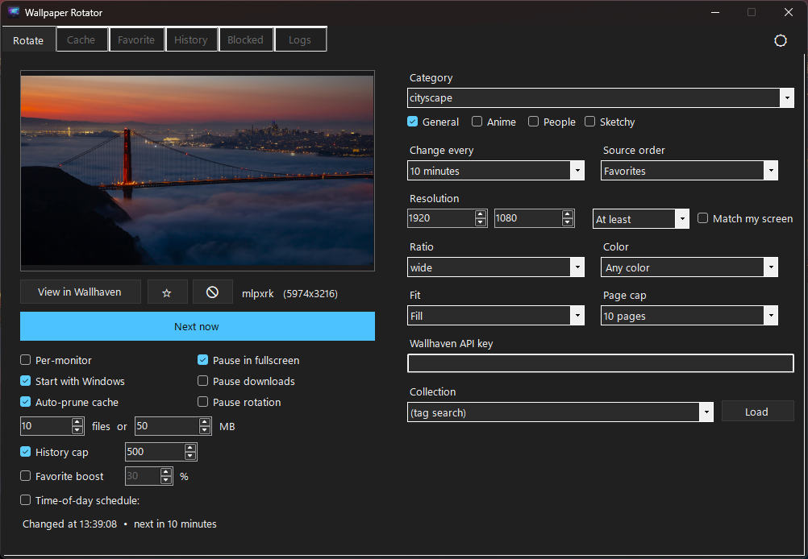

# 🖼️ Wallhaven Slideshow

A **Wallpaper Rotator** for Windows — a C# / .NET 10 desktop app that turns [Wallhaven](https://wallhaven.cc) into an endless, smartly-filtered slideshow for your desktop. Search millions of wallpapers with deep filters, rotate on a schedule (or by real sunrise/sunset), protect favorites, block the misses, manage the cache, and give every monitor its own wallpaper — all from a themed tray-resident app.



## ✨ Features

- 🔄 **Auto-rotation engine** — intervals from 1 minute to 24 hours, manual "Next now", full tray control, pause anytime
- 🎯 **Deep Wallhaven filters** — tags, categories (General/Anime/People), purity, resolution (*at least* / *exactly*), aspect ratio, color palette, 7 source orders and a sampling page cap
- 🌅 **Time-of-day schedule** — four tag slots (morning/afternoon/evening/night) by clock hours **or real sunrise/sunset** computed from your latitude/longitude
- ⭐ **Favorites system** — a "favorite boost" dice (1–100%) that swaps searches for your ★ pool, plus immunity from pruning and history trimming
- 🚫 **Blocklist** — "never show again" per wallpaper (Rotate/Cache/History tabs), with its own Blocked tab and Unblock
- 🧠 **Smart history** — no-repeat memory with an adjustable cap (or *never repeat* mode), a full log tab with timestamps, and one-click **re-download** of pruned wallpapers
- 🖥️ **Per-monitor wallpapers** — a different image on every screen via the COM `IDesktopWallpaper` interface
- 📦 **Cache management** — file-count & MB caps with favorite-aware auto-prune, confirm-protected delete, Explorer shortcut
- 🌙 **Dark & light themes** — fully owner-drawn WinForms theming, including native controls (dropdowns, spinners, list views, title bar)
- 🔌 **Offline resilience** — rotates from cache when the network or Wallhaven is down, with auto-retry + backoff on 5xx errors
- 🗂️ **Collections** — rotate from your Wallhaven collections using a personal API key
- 🧰 **Quality of life** — start with Windows, single instance, pause in fullscreen, six-tab UI, diagnostics log tab, tooltips on every option

## 🛠️ Tech Stack

- C# / .NET 10 — Windows Forms (no external NuGet packages, pure BCL)
- Wallhaven REST API (search, collections, wallpaper info)
- Win32 interop: `SystemParametersInfo` (wallpaper), COM `IDesktopWallpaper` (multi-monitor), `uxtheme` + DWM (dark mode), Registry (fit modes & autostart)
- `System.Text.Json` persistence (settings, history, blocklist) in `%LOCALAPPDATA%\WallpaperRotator`
- Owner-drawn UI: themed tabs, card lists, color swatches, tooltips, self-painting controls

## 🚀 Run it locally

```
git clone https://github.com/nitishengineer/Wallhaven-Slideshow.git
cd Wallhaven-Slideshow
```

Open `WallpaperRotator.sln` in **Visual Studio 2022+** and press **F5** — or from a terminal:

```
dotnet run --project WallpaperRotator
```

Publish a standalone single-file exe:

```
dotnet publish WallpaperRotator -c Release -r win-x64 --self-contained -p:PublishSingleFile=true
```

> **Note:** No API key is needed for normal use. A free key (wallhaven.cc → Settings → API) only unlocks **collections**. Requires Windows 10/11.

## 📁 Project Structure

```
WallpaperRotator/
├── Form1.cs               # main window: Rotate tab, tab host, tray, all settings UI
├── HistoryForm.cs         # Cache tab — thumbnails + set/favorite/block/delete actions
├── FavoriteForm.cs        # Favorite tab — starred wallpapers
├── HistoryLogForm.cs      # History tab — full rotation log with re-download
├── BlockedForm.cs         # Blocked tab — "never again" list with Unblock
├── LogsForm.cs            # Logs tab — live diagnostics viewer
├── DarkTabControl.cs      # borderless, theme-aware TabControl
├── ThemeToggleButton.cs   # self-painting 🌙/☀ switch on the tab strip
├── Theme.cs / Tooltips.cs # dark-light palette + native theming / hover help
├── Models/
│   └── WallhavenModels.cs # API JSON contracts
├── Services/
│   ├── WallhavenClient.cs    # search, collections, downloads, retry w/ backoff
│   ├── RotationEngine.cs     # fetch → filter → pick → download → apply pipeline
│   ├── WallpaperSetter.cs    # Win32 wallpaper + fit modes
│   ├── MultiMonitorSetter.cs # COM IDesktopWallpaper per-screen setting
│   ├── FullscreenDetector.cs # skip rotation during fullscreen apps
│   ├── CacheService.cs       # prune/clear with favorite protection
│   ├── HistoryService.cs     # used-list, favorites, history cap
│   ├── BlocklistService.cs   # permanent "never show again" list
│   ├── SettingsService.cs    # settings.json persistence
│   ├── LogService.cs         # rotating rotator.log
│   └── SolarTimes.cs         # sunrise/sunset computation
└── Program.cs             # single-instance mutex + entry point
```

## 🎓 What I learned

What began as *"can I rotate Wallhaven wallpapers with a small script?"* grew into a complete Windows application — key takeaways:

- Win32 interop from C#: P/Invoke, COM vtables, registry theming, DWM dark title bars
- Designing a resilient network pipeline: page clamping, retry with backoff, offline cache fallback
- Owner-drawing standard WinForms controls to build a coherent dark/light theme
- Event-driven state sync across six embedded tab views (favorites, blocks, applies)
- The full product loop: idea → feature → manual QA → published exe → Git/GitHub workflow

## 🙌 Author

**Nitish** — github.com/nitishengineer

## 📄 License

MIT — see [LICENSE.txt](LICENSE.txt)
